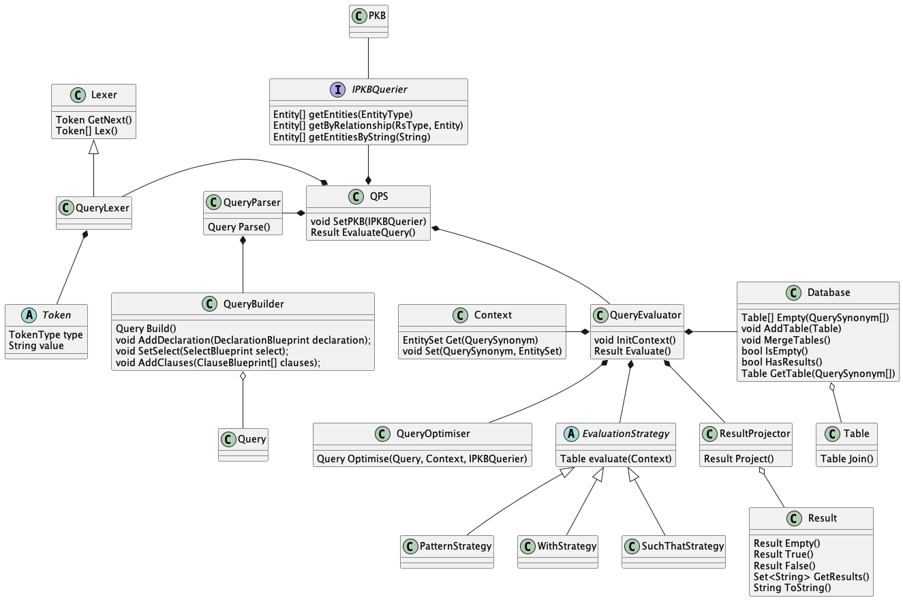
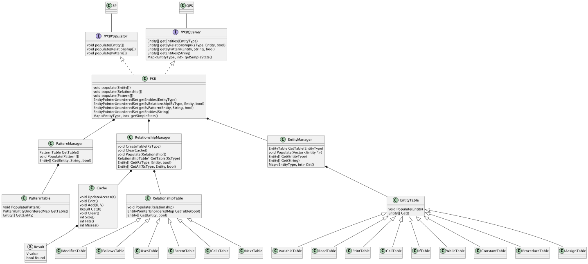
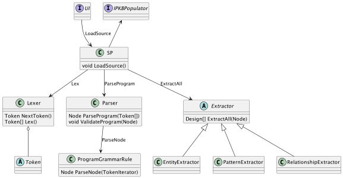
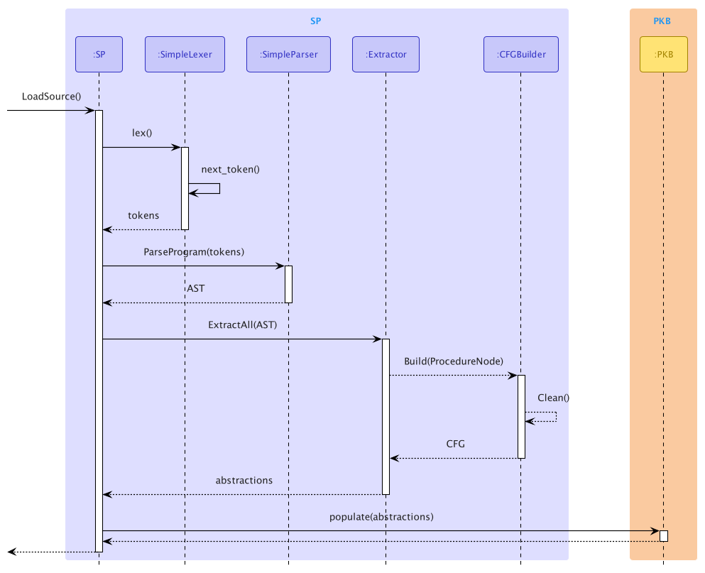

# Developer Guide

## System Architecture

## Query Processing System

### Overview

## Program Knowledge Base

### Overview

## Source Processor

### Overview

### Abstract Syntax Tree Design

### Sequence Diagram

